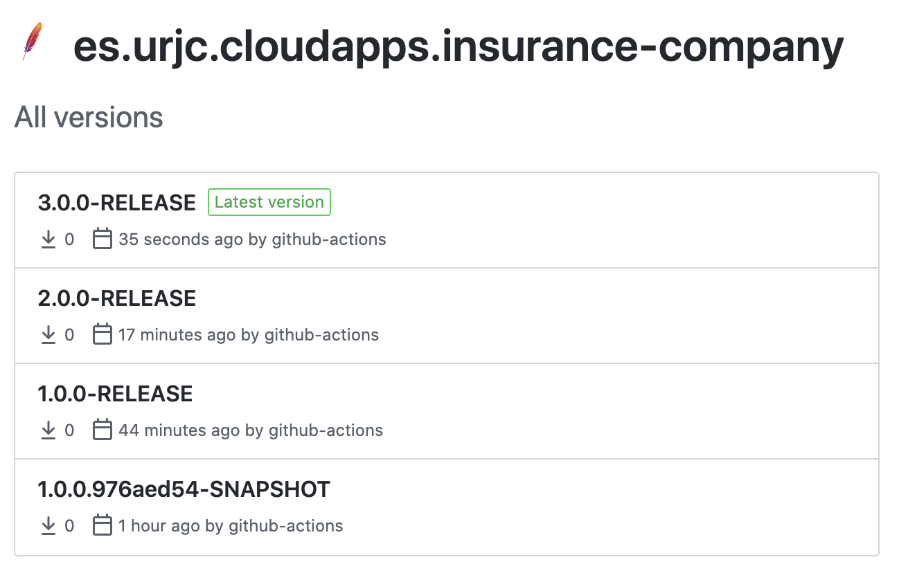
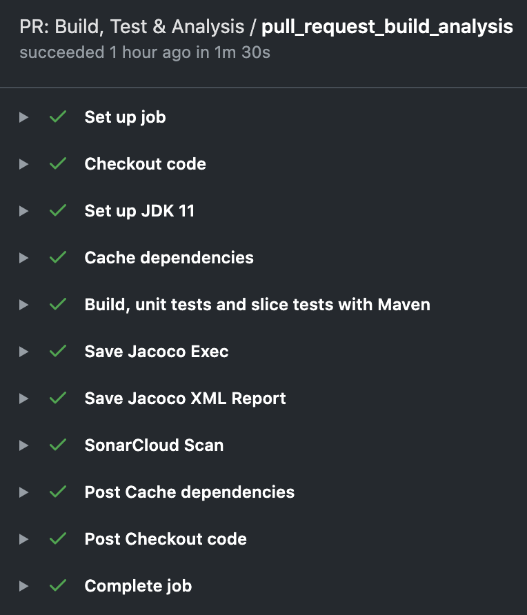
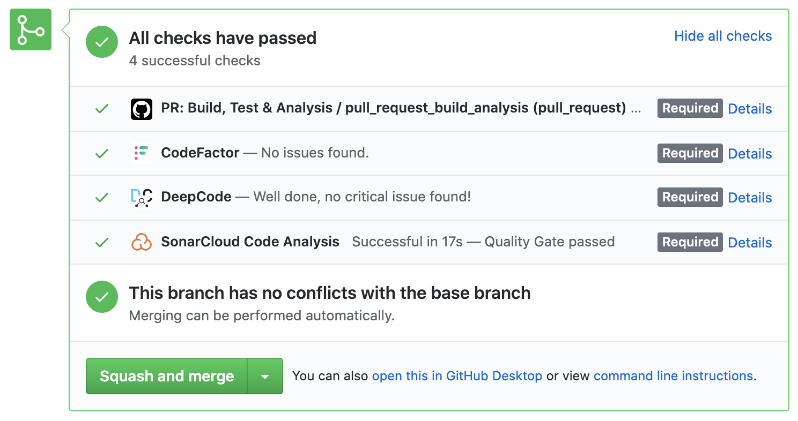
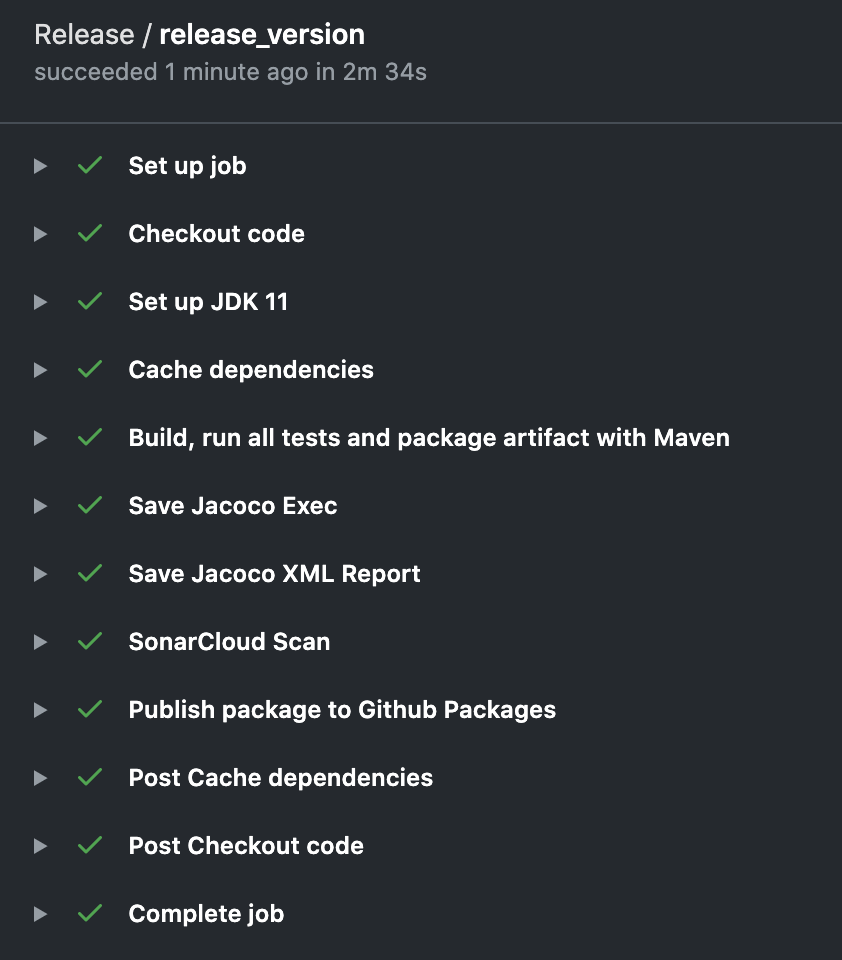
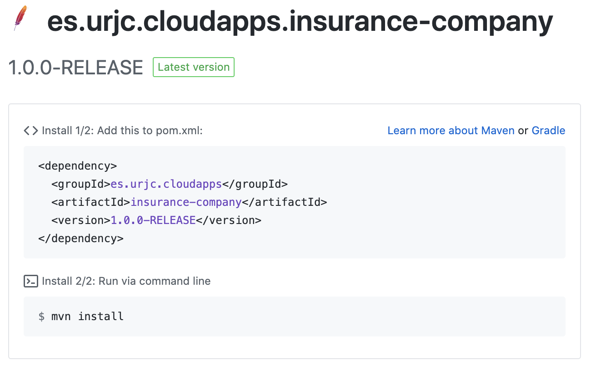
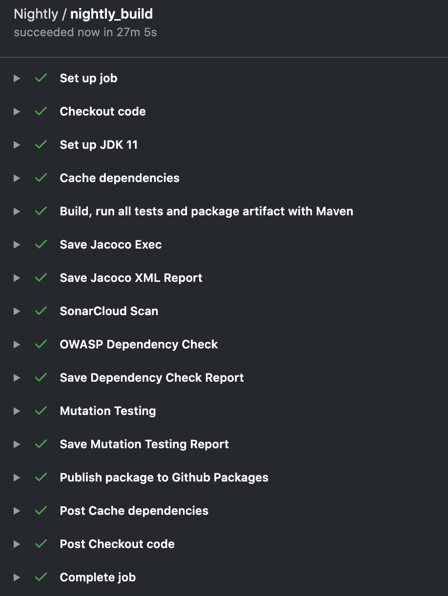

# Documentación de la práctica: Integración y entrega continua. URJC Máster CloudApps<!-- omit in toc -->

## Tabla de contenidos<!-- omit in toc -->

- [Proyecto](#proyecto)
- [Modelo de desarrollo](#modelo-de-desarrollo)
    - [Modo de trabajo paso a paso](#modo-de-trabajo-paso-a-paso)
- [Workflows](#workflows)
    - [Pull request](#pull-request)
    - [Release](#release)
    - [Nightly](#nightly)

## Proyecto

URL del proyecto: [marcosDLCS/urjc_mca_ci_delivery](https://github.com/marcosDLCS/urjc_mca_ci_delivery)

URL del repositorio de artefactos: [Github Packages](https://github.com/marcosDLCS/urjc_mca_ci_delivery/packages)

Un ejemplo de los paquetes creados:

  

## Modelo de desarrollo

En este proyecto se asume un modelo de *branching* que se basa en **TBD *(Trunk Based Development)*** en el que los
desarrollos de las diferentes características o *features* se realizan en pequeñas ramas con origen en máster que se
integran a través del *pull requests*

La rama *master* se ha protegido con las siguientes políticas:

- Paso de los *checks* que incluyen haber superado con éxito la ejecución del *workflow* ***pull-request.yml*** cuyo *
  job* es ***pull_request_build_analysis***
- Se deshabilitan los *force push* a la rama *master*
- Se deshabilitan los borrados en la rama *master*
- **[NO ACTIVADO]:** Revisión de la *pull request* por al menos 1 persona antes de cualquier posibilidad de *merge*.
  Sería recomendable tenerlo activado pero al ser una práctica de una única persona no se ha considerado viable

Otras configuraciones interesantes del repositorio son:

- Habilitar únicamente los *squash merge* en las integraciones
- Eliminar las ramas origen cuando se realizan las *pull requests*

### Modo de trabajo paso a paso

1. Para comenzar una nueva *feature* el desarrollador abre una rama con origen en *master*
2. Una vez terminado el desarrollo el desarrollador crea una *pull request*. Ese paso debe superar los *checks* del *
   workflow* de *pull request*, las métricas de SonarCloud y otras dos métricas de DeepCode y Codefactor que sus
   respectivos *bots* se encargan de orquestar
3. Una vez aceptada la *pull request* ésta se integra mediate un *squash merge*
4. Por otro lado cada noche a las 3AM se lanza el *workflow* correspondiente a la *nightly*
5. Para finalizar, en el caso de querer hacer una *release*, el administrador del repo acudiría por ejemplo a la
   interfaz de GitHub para la creación de la propia *release* haciendo *push* del *tag* de versión seleccionado y
   añadiendo una descripción. En el momento de publicarse dicha *release* el *workflow* correspondiente se lanzaría

## Workflows

### Pull request

En el *workflow* de ***pull-request*** se realizan las siguientes acciones:

- Descarga del código
- Recuperación de las dependencias en caché
- Compilación del código
- Paso de tests unitarios y *slice tests*
- Publicación en salida del *job* de los ficheros de cobertura de JaCoCo (exec y XML)
- Paso de análisis estático con Sonar
- Tareas automáticas de Github Actions *post-workflow*

  

De manera añadida se han configurado los *bots* de [DeepCode.ai](https://www.deepcode.ai/)
y [CodeFactor](https://www.codefactor.io/) para que se ejecuten siempre en cada *pull request*

  

### Release

En el *workflow* de ***release*** se realizan las siguientes acciones:

- Descarga del código
- Recuperación de las dependencias en caché
- Cambio de la versión actual del código a una con el siguiente esquema: **<version>.-RELEASE**
- Compilación del código
- Paso de tests unitarios, *slice tests* y test de integración (Rest Assured + TestContainers)
- Creación del artefacto **.jar**
- Publicación en salida del *job* de los ficheros de cobertura de JaCoCo (exec y XML)
- Paso de análisis estático con Sonar
- Publicación del artefacto en GitHub Packages
- Tareas automáticas de Github Actions *post-workflow*

  

El artefacto resultante se puede consultar en la sección de paquetes del repositorio:

  

### Nightly

En el *workflow* de ***nightly*** se realizan las siguientes acciones:

- Descarga del código
- Recuperación de las dependencias en caché
- Cambio de la versión actual del código a una con el siguiente esquema: **<version>.<sha-8-posiciones>-SNAPSHOT**
- Compilación del código
- Paso de tests unitarios, *slice tests* y test de integración (Rest Assured + TestContainers)
- Creación del artefacto **.jar**
- Publicación en salida del *job* de los ficheros de cobertura de JaCoCo (exec y XML)
- Paso de análisis estático con Sonar
- Paso de análisis de dependencias de OWASP y publicación de resultados
- Fase de tests de mutación y publicación de resultados
- Publicación del artefacto en GitHub Packages
- Tareas automáticas de Github Actions *post-workflow*

  

El *workflow* se lanza cada día a las 3:01AM de la mañana siguiendo el formato de crontab __[1 3 * * *]__
